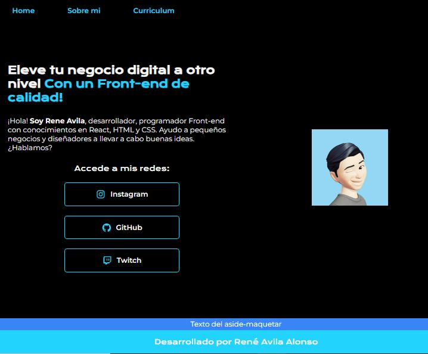

## Plantilla de Readme de Alura Latam

Plantilla para personalizar el readme de los proyectos de [Alura Latam](https://www.aluracursos.com/)). El objetivo de esta plantilla es ayudar a las personas que quieren crear readmes más informativos y descriptivos. Considera este modelo como base, pero si lo prefieres, ajusta los detalles según tus necesidades y, si lo deseas, [revisa este artículo que enseña cómo personalizar readmes en general](https://www.aluracursos.com/blog/como-escribir-un-readme-increible-en-tu-github).

Al crear tu readme, elimina toda la información anterior y mantén solo la imagen de portada y el contenido restante a partir del título **"Nombre del proyecto"**.

## Imagen de portada

Añade la imagen de portada con el tema de tu proyecto:

Después de agregar la imagen, también modifica las configuraciones del proyecto para asegurarte de que la imagen se cargue como miniatura:

**Settings** > **Options** > **Social preview** > **Edit** > **Upload an image...**

  
<b>Demostración de la adición de miniatura<b/>

    

    

  
# Nombre del proyecto

Portafolio

## 🔨 Funcionalidades del proyecto

Indica cuáles son las funcionalidades y comportamientos de la App.

Si es posible, presenta un ejemplo visual del proyecto, ya sea gif, imágenes o video. A continuación, un ejemplo:

## ✔️ Técnicas y tecnologías utilizadas

**Haz una lista de las tecnologías y técnicas utilizadas (la justificación y descripción son opcionales)**:

- `Funcionalidad 1`: descripción de la funcionalidad 1
- `Funcionalidad 2`: descripción de la funcionalidad 2
  - `Funcionalidad 2a`: descripción de la funcionalidad 2a relacionada con la funcionalidad 2
- `Funcionalidad 3`: descripción de la funcionalidad 3

## 📁 Acceso al proyecto

**Indica cómo se puede descargar o acceder al código fuente del proyecto, ya sea el proyecto inicial o final.**

## 🛠️ Abrir y ejecutar el proyecto

**Presenta las instrucciones necesarias para abrir y ejecutar el proyecto.**

## 📚 Más información del curso

**Haz un CTA (_call to action_) para el curso del proyecto.**

--- 

Isso preserva a estrutura Markdown do template original, adaptando o conteúdo para o espanhol informal.
